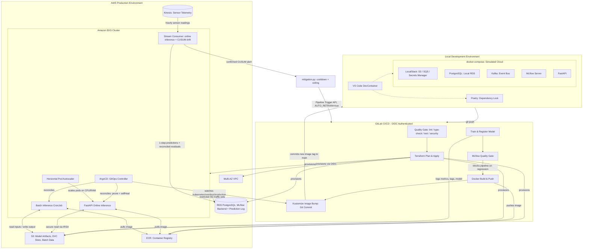

# Transformer Oil Temperature Forecasting: An End-to-End MLOps Platform on AWS EKS

*Read this in other languages: [Español](README_es.md)*

[](https://www.python.org/)
[](https://github.com/psf/black)
[](https://github.com/astral-sh/ruff)
[](https://about.gitlab.com/)
[](https://python-poetry.org/)
[](https://www.docker.com/)
[](https://kubernetes.io/)
[](https://aws.amazon.com/)
[](https://www.terraform.io/)
[](https://mlflow.org/)
[](LICENSE)

## Table of Contents

- [Executive Summary](#executive-summary)
- [System Architecture](#system-architecture)
- [Technology Stack](#technology-stack)
- [The MLOps Pipeline](#the-mlops-pipeline)
- [Security Model](#security-model)
- [Monitoring & Observability](#monitoring--observability)
- [Getting Started](#getting-started)
- [Code Quality & Shift-Left Validation](#code-quality--shift-left-validation)
- [Repository Structure](#repository-structure)
- [Architectural Decisions & Trade-offs](#architectural-decisions--trade-offs)
- [Roadmap](#roadmap)
- [License](#license)

---

## Executive Summary

### The Problem

Deep learning architectures for time series forecasting, such as DLinear, achieve strong accuracy on benchmarks like ETT (Electricity Transformer Temperature) — predicting a transformer's oil temperature from its own load and environmental sensor readings is a well-studied, high-value industrial problem. However, a critical gap exists between a model that performs well in a notebook and a model that runs reliably in production: non-deterministic dependencies ("it works on my machine"), manual and undocumented infrastructure provisioning, untraceable model versions, and no safeguard preventing a worse model from silently replacing a better one in production.

Additionally, serving time series predictions typically requires supporting both low-latency real-time requests and heavy offline batch scoring, and naively doing both means either duplicating infrastructure or accepting an inefficient compromise.

### The Solution

This repository implements an end-to-end, production-grade MLOps platform that trains, validates, registers, and serves a DLinear multivariate forecasting model on Amazon Web Services, built strictly "local-first": every capability is proven on a laptop with disposable containers before it is ever pointed at a real AWS account.

The platform is designed around Site Reliability Engineering principles from day one: 100% Infrastructure as Code, zero-trust network topology, deterministic dependency management, a hybrid inference system (online API + batch scoring) sharing a single container image, and a GitOps-managed Amazon EKS cluster where the cluster's desired state lives in Git, not in anyone's shell history.

### Impact

- **No untraceable model ever reaches production.** Every training run is bound to an immutable tuple — Git commit hash, DVC data hash, hyperparameters, MLflow run ID, and container image tag — so any prediction served in production can be traced back to the exact code, data, and configuration that produced it.
- **A regression can never ship automatically.** The MLflow-backed quality gate compares every newly trained model against the one currently serving traffic and blocks promotion — and therefore blocks `build-push`/`deploy` — unless the new model is at least as good.
- **Full end-to-end iteration in seconds, not hours.** A fixed, DVC-versioned ~1,000-row toy dataset exercises the entire pipeline — data contracts, preprocessing, hyperparameter search, training, MLflow registration — on a laptop, with no GPU and no cloud cost, before the full dataset is ever touched.
- **Zero manual setup for a new contributor.** A DevContainer plus a `docker-compose.yml` replica of the whole cloud stack (PostgreSQL, LocalStack, Kafka, MLflow, the API) means a new engineer runs `make up` and is productive immediately — no local Python installation, no AWS credentials, no shared "works on my machine" state.
- **Nothing reaches AWS that hasn't already passed a cheaper, faster, local gate first, and no CI/CD job consumes GitLab.com's shared-runner minutes.** Pre-commit hooks, local Testcontainers-based integration tests, a local pipeline emulator (`gitlab-ci-local`), and two self-hosted runners (one on the developer's own hardware, tag `local-hardware`; another inside the EKS cluster, tag `in-vpc`) catch failures and run the real pipeline without touching a single shared GitLab compute resource.
- **A real 48-hour forecast, not a one-step lookup.** The model predicts the next 48 hourly oil-temperature readings from the last 48 — one of the standard DLinear-paper horizons for this exact dataset — instead of a single next-reading prediction, which on this series is close to indistinguishable from a naive "next reading equals the last one" baseline and would prove little about the model's actual forecasting ability.

---

## System Architecture

The system spans three operational scopes: local development (a full emulation of the cloud), CI/CD automation, and the AWS production environment reconciled by GitOps.



### Data Flow

1. **Ingestion & validation.** Raw ETT sensor readings (7 numeric channels, hourly) are loaded and immediately checked against a Pydantic data contract — schema, dtypes, null-ability, per-feature value ranges — before any preprocessing begins.
2. **Feature engineering.** `data_processing.py` derives temporal features (month, day, hour), scales the series, and builds sliding windows for the DLinear model.
3. **Training.** `train.py` runs an Optuna hyperparameter search, trains the DLinear network, and logs metrics, parameters, and reproducibility tags to MLflow — bundling the trained network together with its input/output scalers into a single custom `pyfunc` model.
4. **Registration & quality gate.** The trained model is registered in the MLflow Model Registry. `quality_gate.py` only advances the `production` alias if the candidate is at least as good as the current production model.
5. **Serving.** The API and the batch CronJob both resolve the model by `name@production_alias` from the registry at startup — never from a file path — and serve online predictions or write batch predictions back to S3, respectively. `POST /predict` returns `predictions`, a 48-value list (one per forecasted hour); batch scoring writes one `Prediction_h1..Prediction_hN` column pair per row for the same horizon.
6. **Deployment.** CI builds and pushes the container image, then edits the Kustomize overlay's image tag and commits it to `main`. ArgoCD detects the change in Git and reconciles the cluster — CI itself never touches the cluster's API server.
7. **Streaming inference & mitigation.** [`stream_consumer.py`](core_ml/src/monitoring/stream_consumer.py) reads sensor readings from Kinesis, produces a 1-step-ahead prediction every 48 hours of accumulated window, and reconciles older ones into residuals. Two CUSUM trackers watch for a physical sensor shift (data drift) and a shift in the model's own accuracy (concept drift); a confirmed alert may launch a bounded, cooldown-guarded retrain through the same CI pipeline — routed back to step 3 through GitLab's Pipeline Trigger API — never bypassing step 4's quality gate.

---

## Technology Stack

| Category | Tools Used | Purpose in This Project |
|---|---|---|
| **Machine Learning** | PyTorch, DLinear, Optuna | Multivariate time series forecasting model and hyperparameter search. |
| **Tracking & Registry** | MLflow (Tracking + Model Registry, aliases) | Experiment tracking, immutable model versioning, quality-gated promotion. |
| **Data & Reproducibility** | DVC (S3-backed), Pydantic | Dataset/model versioning and fail-fast data contracts. |
| **API Serving** | FastAPI, Uvicorn | Low-latency online inference endpoint. |
| **Containerization** | Docker, Docker Compose | Single reproducible image for online + batch inference; full local cloud emulation. |
| **Orchestration** | Kubernetes, Amazon EKS, Kustomize | Production workload scheduling, structural (non-templated) config management. |
| **GitOps** | ArgoCD | Continuous reconciliation of cluster state from Git, with drift auto-correction. |
| **Local Cloud Simulation** | LocalStack, Apache Kafka, Testcontainers | S3/SQS/Secrets Manager emulation and ephemeral-container integration testing. |
| **Infrastructure as Code** | Terraform | Declarative provisioning of VPC, EKS, RDS, S3, ECR, IAM. |
| **CI/CD** | GitLab CI/CD, OpenID Connect, gitlab-ci-local, self-hosted runners (local Docker + EKS) | OIDC-authenticated pipelines; local job validation before pushing; real execution without consuming GitLab.com's shared-runner minutes. |
| **Observability & Resilience** | structlog, tenacity, pybreaker | JSON structured logging, bounded retries with backoff, circuit breaking. |
| **Streaming & Drift Detection** | Amazon Kinesis Data Streams, CUSUM (Page's test) | Sensor telemetry ingestion; data/concept drift detection via change-point statistics, not a distribution-shape library. |
| **Automatic Mitigation & Promotion** | GitLab Pipeline Trigger API, MLflow Model Registry aliases | Cooldown- and ceiling-bounded auto-retrain on a confirmed drift alert; `quality_gate.py`'s production-vs-candidate comparison (with tolerance and one-step rollback) gates every promotion. |
| **Cloud Services** | Amazon S3, ECR, RDS PostgreSQL, Kinesis, VPC | Managed storage, registry, database, streaming and networking. |
| **Local Development** | DevContainers, Poetry, Makefile | Standardized environment, deterministic dependencies, single execution interface. |
| **Code Quality** | Ruff, Black, isort, mypy, pytest, Bandit, Trivy, yamllint, detect-secrets | Shift-left static analysis, formatting, typing, testing and security scanning. |
| **Security** | IRSA, AWS STS, zero-trust networking | Short-lived, scoped credentials; no long-lived secrets in application code. |

---

## The MLOps Pipeline

### Data Pipeline

Training and inference never trust raw input blindly. `core_ml/src/data_contracts.py` declares a Pydantic-based schema for the ETT dataset — required columns, dtypes, null-ability, and per-feature value ranges calibrated against the full ETTh1 series. `data_processing.py`, `batch_inference.py`, and the API's `PredictionRequest` model all validate against this contract (or the equivalent Pydantic field constraints, in the API's case) and reject immediately — `DataContractError` locally, HTTP 422 at the API boundary — instead of burning compute on a run doomed to fail, or worse, silently producing garbage predictions. This is the **fail-fast** principle applied to data, not just to code.

For fast iteration, `core_ml/data/toy/ETTh1_toy.csv` is a fixed, representative ~1,000-row slice of the full dataset — same schema, same contract, fewer rows — version-controlled with DVC. `make train-toy` runs the entire pipeline in seconds, so the full loop is exercised locally before the full dataset or a GPU is ever touched.

`core_ml/data/{raw,toy}/*.csv` are tracked with DVC, backed by the same S3 bucket used for model artifacts. Only the small `.dvc` pointer files (content hashes) are committed to Git; `dvc pull`/`dvc push` move the actual bytes. This is the foundation of the reproducibility tuple described below.

### Training Pipeline

`train.py` runs an Optuna hyperparameter search over the DLinear architecture and trains the winning configuration. Every run is bound, via `mlflow_utils.py::build_reproducibility_tags()`, to five coordinates logged as MLflow tags and parameters:

```
Git Commit Hash + DVC Data Hash + Hyperparameters + MLflow Run ID + Container Image Tag
```

Any model in the registry can therefore be traced back to the exact code, data, configuration, and container image that produced it — a hard requirement for debugging a production incident or auditing a model's provenance.

There is no `model.pkl` sitting in a directory anywhere in this repository or its deployed containers. `train.py` bundles the trained DLinear network together with its input/output scalers into a single custom `mlflow.pyfunc.PythonModel` and registers it in the MLflow Model Registry as an immutable, versioned artifact.

### Deployment Pipeline (CI/CD)

Every push triggers a GitLab CI/CD pipeline authenticated to AWS via OIDC (no long-lived IAM user credentials). Stages run strictly sequentially, so a failure at any stage blocks everything after it:

```
push to main
  -> quality        (make ci: lint, format, types, tests, security; Trivy scan)
  -> plan            (terraform plan)
  -> apply            (terraform apply, main branch only)
  -> train             (Optuna search, MLflow logging & registration)
  -> quality-gate       (candidate model must beat production or the pipeline stops)
  -> build-push          (Docker image built and pushed to ECR, tagged with the commit SHA)
  -> deploy               (Kustomize image bump, committed to main with [skip ci])
```

The final `deploy` stage never touches the Kubernetes API server directly: it performs a structural `kustomize edit set image` on `kubernetes/overlays/production/`, commits the change, and pushes with a `[skip ci]` marker to avoid a self-triggering pipeline loop. ArgoCD, running inside the cluster, detects the new commit and reconciles the cluster to match — CI proposes, GitOps disposes.

---

## Security Model

Security is enforced at both the identity and network layers.

- **IAM Roles for Service Accounts (IRSA).** Pods running the API and the batch job access S3 through short-lived AWS STS credentials injected dynamically by EKS. No AWS keys are stored in Kubernetes Secrets or hardcoded into the application.
- **GitLab OIDC integration.** The CI/CD pipeline authenticates to AWS via OpenID Connect (`aws_iam_openid_connect_provider` plus a `sub` claim scoped to this exact project/branch), eliminating long-lived IAM user credentials from CI entirely.
- **Least-privilege separation.** The GitLab CI role used for training/build is scoped only to the ECR repository and S3 bucket it actually needs; Terraform's own `apply` role is kept separate. A compromised build or training job cannot escalate to infrastructure administrator.
- **Network isolation.** The RDS PostgreSQL instance lives in private subnets; its Security Group whitelists traffic only from the Security Group attached to EKS worker nodes, instead of relying on broad CIDR ranges.
- **GitOps as a security boundary.** CI never holds cluster-admin credentials — it can only propose a change in Git. ArgoCD, running inside the cluster with its own scoped access, is the only actor that ever mutates cluster state.

---

## Monitoring & Observability

- **Structured logging.** `api/logging_config.py` and `core_ml/src/logging_config.py` configure `structlog` once per process: a single-line JSON object per event (`event`, `level`, `timestamp`, plus structured fields like `model_uri`, `duration_ms`, `n_predictions`) when stdout isn't a TTY, and a readable colored renderer in an interactive terminal. JSON-per-line is exactly what CloudWatch Logs Insights or Elasticsearch need to filter and aggregate by field instead of regexing free text.
- **Latency tracking.** Every `/predict` call logs its duration in milliseconds alongside the resolved model version, giving a per-request, per-model-version view of serving latency directly in the log stream.
- **Resilience: bounded retries and a circuit breaker.** `api/main.py` wraps MLflow Model Registry loading in `tenacity` (bounded exponential backoff, three attempts maximum — never infinite) and `pybreaker` (after five consecutive failures, the breaker opens and fails fast for 60 seconds instead of continuing to hammer a downed registry). `core_ml/src/batch_inference.py` applies the same bounded retry to its S3 calls.
- **Infrastructure drift detection.** ArgoCD runs with `prune: true` and `selfHeal: true`: any manual `kubectl` change or configuration drift in the cluster is automatically detected and reverted to match Git, so the cluster's actual state can never silently diverge from its declared state.
- **Graceful degradation over crash-looping.** The API's startup does not treat "no `production` model registered yet" as fatal: `/health` (liveness) always returns 200, while `/ready` and `/predict` return 503 until a model is promoted — the correct Kubernetes semantics for separating "the process is alive" from "the process is ready to serve".

- **Streaming sensor ingestion (Amazon Kinesis).** [`terraform/kinesis.tf`](terraform/kinesis.tf) provisions an on-demand Kinesis Data Stream; [`scripts/sensor_simulator.py`](core_ml/scripts/sensor_simulator.py) replays ETTh1's historical hourly readings onto it (there is no live sensor in this portfolio to stream from — the same situation 610-hotel-booking-mlops solves with its own `replay_bookings.py`). Kinesis, not Kafka: this domain is one physical sensor, not many independent event producers, and Kinesis's simpler per-shard iterator model fits that better than a consumer-group-based broker would.
- **Online inference + CUSUM drift detection.** [`core_ml/src/monitoring/stream_consumer.py`](core_ml/src/monitoring/stream_consumer.py) consumes that stream: for every 48 consecutive hourly readings it accumulates, it asks the served model for the *next* hour's oil temperature and records that 1-step-ahead prediction ([`drift_store.py`](core_ml/src/monitoring/drift_store.py), a second schema in the same RDS instance MLflow's backend store already uses); every new reading is also a chance to reconcile an older prediction into a residual. Two independent two-sided CUSUM (Page's test) trackers — [`changepoint.py`](core_ml/src/monitoring/changepoint.py) — watch, respectively, the seven raw sensor readings for a physical level shift (data drift) and the reconciled residuals for a shift in the model's own accuracy (concept drift). CUSUM, not PSI/Jensen-Shannon histograms: those fit categorical, per-booking attributes (610's own domain); a continuous physical reading from one machine over time is a level-shift question, the exact thing change-point detection is built for.
- **Bounded automatic mitigation.** A confirmed CUSUM alert reaches [`mitigation.py`](core_ml/src/monitoring/mitigation.py), which may launch a retrain through GitLab's Pipeline Trigger API — bounded by a cooldown (one trigger per incident) and a hard ceiling on automatic retrains per rolling window, so a drift source a retrain cannot fix reaches a human instead of retriggering forever. What it cannot do is promote anything: [`quality_gate.py`](core_ml/src/quality_gate.py) already refused to move the `production` alias without comparing a candidate to whatever is currently serving, and that comparison — now with a configurable `--tolerance` and one-step `--rollback` — still stands between every retrain, automatic or manual, and production traffic.

---

## Getting Started

To guarantee the code behaves identically in the cloud, validate it against the local replica first.

### 1. Initialize the Environment

Open the repository in VS Code using the Dev Containers extension. This provisions Python, Poetry, `make`, Terraform, the AWS CLI, Docker-in-Docker, and `pre-commit` — no local Python installation required.

### 2. Install Dependencies and Git Hooks

```bash
make install   # poetry install --sync for api/ and core_ml/ (deterministic, from poetry.lock)
make hooks     # installs the pre-commit git hooks (pre-commit + pre-push)
```

Both subprojects (`api/` and `core_ml/`) are independent Poetry projects, each with its own `poetry.lock`, so the dependency set installed here is byte-for-byte identical to what CI and the production container install.

### 3. Start the Local Emulation Stack

```bash
make up   # docker compose up -d --build --wait
```

This launches the entire simulated cloud, in dependency order (Postgres/LocalStack healthy -> MLflow healthy -> API):

- PostgreSQL (RDS emulation)
- LocalStack (S3 + SQS + Secrets Manager — auto-bootstrapped, see `localstack/init/`)
- Kafka (KRaft, single broker)
- MLflow (tracking + registry, backed by the two above)
- FastAPI

`make down` tears it down; `make logs` / `make ps` inspect it while it's running.

### 4. Train and Serve

Run the whole pipeline end-to-end against the ~1,000-row toy dataset first — data contract validation, preprocessing, training, and MLflow registration all complete in seconds, no GPU required:

```bash
make train-toy
```

Then promote it so the API can pick it up:

```bash
cd core_ml && poetry run python -m src.quality_gate
```

The local FastAPI service (targeting the docker-compose MLflow stack) resolves the model by name and `production` alias on startup — no manual artifact copying. Once you're confident, run the same steps against the full dataset (`make data-raw` + `poetry run python -m src.train --dataset raw`).

With a `production` model in place, exercise the streaming side the same way — [`scripts/sensor_simulator.py`](core_ml/scripts/sensor_simulator.py) replaying readings onto the LocalStack Kinesis stream and [`stream_consumer.py`](core_ml/src/monitoring/stream_consumer.py) consuming them, both against the exact code path production runs, no real AWS account involved:

```bash
make stream-local   # everything from a cold stack: up -> train-toy -> quality-gate -> stream-up -> stream-replay
make stream-logs     # follow the consumer's CUSUM verdicts and mitigation attempts
```

### 5. Validate Before Committing

The `Makefile` is the single entry point for every quality check — the exact same targets run locally (via git hooks) and in CI:

```bash
make lint          # Ruff
make format         # isort + Black (auto-fix)
make format-check    # isort + Black (check only, used in CI)
make type-check       # mypy
make test              # pytest + coverage
make security           # Bandit (SAST)
make yaml-lint           # yamllint on all CI/K8s/compose manifests
make secrets-scan         # detect-secrets
make trivy                 # dependency/IaC vulnerability scan (requires Docker)
make ci                     # everything above, in one shot -- identical to the CI "quality" stage
```

`pre-commit` (installed by `make hooks`) enforces this automatically: a commit is rejected if formatting, linting, type checking, tests, YAML syntax, or a leaked secret fails. See [Code Quality & Shift-Left Validation](#code-quality--shift-left-validation) below.

Terraform and Kubernetes changes get the same treatment — no AWS credentials, no cluster, no cost:

```bash
make tf-fmt        # terraform fmt -check
make tf-validate     # terraform init -backend=false + validate (downloads providers/modules only)
make k8s-build        # kustomize-renders the production overlay - the exact manifests ArgoCD would apply
```

### 6. Validate the Full CI/CD Pipeline, Locally

Nothing has been pushed to GitLab yet. `gitlab-ci-local` reads the same `.gitlab-ci.yml` and runs any job inside Docker containers on this machine, byte-for-byte the same as a real runner — so syntax errors, base image issues, or `before_script` mistakes are caught and fixed here, without burning CI minutes or opening a broken pipeline on GitLab:

```bash
make ci-local-list             # validates .gitlab-ci.yml syntax/stages/needs, without running anything
make ci-local JOB=python:quality   # runs a single job (usage: JOB=<job-name>)
```

> On Windows/Git Bash, `make ci-local` already exports `MSYS_NO_PATHCONV=1` — without it, Git Bash rewrites the internal paths (`/builds/...`) that `gitlab-ci-local` passes to `docker create`, and the job fails with `the working directory '...' is invalid` before a single line of the script runs.

### 7. Self-Hosted Runner: the REAL Pipeline, Without Spending GitLab Minutes

`gitlab-ci-local` (step 6) simulates the pipeline *before* the push. For GitLab to also run the *real* pipeline (the one it dispatches automatically on every push) without touching GitLab.com's shared runners, this same hardware is registered as a self-hosted runner. This is the same strategy already used by `kubernetes/gitlab-runner/` for `train_model`/`quality_gate` (tag `in-vpc`, inside the EKS cluster because it needs MLflow's internal cluster DNS) — extended here with a second runner, on your own PC, for the rest of the jobs (`local-hardware`): quality, terraform, build-push, and deploy.

Bootstrap (one time only):

```bash
# 1. GitLab.com -> project (or group) -> Settings -> CI/CD -> Runners -> "New runner"
#    -> tags: local-hardware -> "Run untagged jobs": No -> copy the token (glrt-...)
make runner-register TOKEN=glrt-xxxxx   # registers this PC (the token stays only in a Docker volume, never in Git)
make runner-up                          # keeps it running 24/7 (--restart always)
make runner-status                      # confirms it connected ("is alive")
```

From here on, every push to GitLab dispatches the full pipeline to runners running on your own infrastructure (this PC + the pod inside EKS) — GitLab.com's shared-minute counter never moves. Authentication to AWS is still short-lived OIDC (`.aws-auth`/`.aws-auth-terraform` in `.gitlab-ci.yml`); moving a job to a runner never means falling back to static credentials.

`make runner-logs` tails whichever job is currently running; `make runner-down` stops the container without losing its registration (so it can be brought back up with `make runner-up`).

### 8. Commit and Deploy

With local validation complete (steps 5-6) and the self-hosted runner active (step 7), push the changes to GitLab. The CI/CD pipeline automatically runs the same shift-left quality gate on every push, plans and applies infrastructure changes, trains and quality-gates a new model, builds and pushes the container image, and — on `main` only — bumps the Kustomize image tag so ArgoCD can reconcile the cluster.

---

## Code Quality & Shift-Left Validation

This project treats local development as the first and cheapest place to catch problems ("local-first"). Every check that can run before a commit reaches the remote, does.

| Concern | Tool | Enforced by |
|---|---|---|
| Dependency determinism | Poetry + `poetry.lock` (one per subproject) | `make install` |
| Import sorting | isort (`profile = black`) | pre-commit + `make format` |
| Code formatting | Black | pre-commit + `make format` |
| Static linting | Ruff | pre-commit + `make lint` |
| Type checking | mypy | pre-commit (local hook, real Poetry venv) + `make type-check` |
| Unit tests | pytest + coverage | pre-commit (local hook) + `make test` |
| SAST / security linting | Bandit | pre-commit + `make security` |
| Dependency/IaC vulnerability scan | Trivy | pre-push hook + CI (`security:trivy`) |
| YAML syntax & style | `check-yaml` + yamllint | pre-commit + `make yaml-lint` |
| Secret detection | detect-secrets | pre-commit (blocks the commit) |
| Generic file hygiene | pre-commit-hooks | trailing whitespace, large files, merge conflicts, TOML/JSON syntax |

A commit is **rejected automatically** if linting, formatting, type checking, or tests fail, if a YAML file is invalid, or if a probable secret is detected. Trivy runs on `git push` (and in CI) rather than on every commit, since a full vulnerability scan is too slow for the commit-time feedback loop.

The `Makefile` (`make help` lists every target) is the single interface for all of this — locally and in `.gitlab-ci.yml`'s `quality` stage — so there is never a discrepancy between "it passed on my machine" and "it passed in CI".

---

## Repository Structure

```text
612 Forecasting Oil Temperature MLOPS/
├── .devcontainer/                 # Standardized local development environment
│   ├── Dockerfile                 # Poetry, make, pre-commit, Terraform, AWS CLI
│   └── devcontainer.json
├── .gitlab-ci.yml                 # CI/CD pipeline (quality gate, Terraform, Docker, K8s) via OIDC
├── .pre-commit-config.yaml        # Shift-left git hooks (lint/format/type/test/secrets/YAML)
├── .yamllint.yml                  # YAML style rules
├── .secrets.baseline              # detect-secrets baseline (audited findings)
├── .trivyignore                   # Explicitly accepted Trivy findings, with justification
├── .dvc/                          # DVC remote config (S3-backed dataset/model versioning)
├── .dvcignore
├── localstack/init/                # Bootstrap scripts: provisions S3/SQS/Secrets Manager on startup
├── docker-compose.yml              # Postgres, LocalStack, Kafka, MLflow, API -- the simulated cloud
├── Makefile                       # Single execution interface -- local == CI
├── terraform/                     # IaC definitions (AWS)
│   ├── ecr.tf                     # Container registry and retention policies
│   ├── eks.tf                     # Kubernetes v1.36 cluster setup with OIDC/IRSA
│   ├── iam.tf                     # IAM roles and service accounts
│   ├── provider.tf                # AWS configuration and S3 backend state
│   ├── rds.tf                     # PostgreSQL backend with zero-trust SG
│   ├── s3.tf                      # Versioned storage for ML artifacts
│   ├── variables.tf                # Environment variables
│   └── vpc.tf                      # Multi-AZ networking and subnets
├── kubernetes/                    # Kustomize: base + overlays (GitOps-managed by ArgoCD)
│   └── base/, overlays/production/
├── gitops/argocd/                 # ArgoCD Application manifest + bootstrap instructions
├── core_ml/                       # Model training and offline pipeline (own Poetry project)
│   ├── pyproject.toml / poetry.lock
│   ├── data/
│   │   ├── raw/ETTh1.csv.dvc      # Full dataset, DVC-tracked (17,420 rows)
│   │   └── toy/ETTh1_toy.csv.dvc  # ~1,000-row toy dataset for second-scale E2E runs
│   ├── src/
│   │   ├── data_contracts.py      # Pydantic data contract + fail-fast validation
│   │   ├── data_processing.py     # Time series preprocessing (contract-validated)
│   │   ├── model_architecture.py  # DLinear network -- single source of truth
│   │   ├── train.py               # Training loop (Optuna) + MLflow logging/registration
│   │   ├── mlflow_utils.py        # Reproducibility tags + pyfunc model bundling
│   │   ├── quality_gate.py        # Promotes a model version to `production` or blocks CI
│   │   ├── events.py               # Best-effort Kafka event publishing
│   │   ├── logging_config.py       # structlog: JSON logs in prod, readable locally
│   │   └── batch_inference.py      # S3-based massive offline scoring script (retry-wrapped)
│   └── tests/                      # pytest unit tests, plus tests/integration/ (Testcontainers)
├── api/                           # Online inference logic (own Poetry project)
│   ├── pyproject.toml / poetry.lock
│   ├── logging_config.py          # structlog: JSON logs in prod, readable locally
│   ├── main.py                    # /health, /ready, /predict -- tenacity + pybreaker around model loading
│   └── tests/                     # pytest unit tests for main.py
├── Dockerfile                     # Production image (installs api/ via poetry.lock only)
├── README.md                      # This file
└── README_es.md                   # Spanish translation
```

---

## Architectural Decisions & Trade-offs

Every non-obvious choice below was made deliberately, with an explicit trade-off — not by default or by convention.

**FastAPI over Flask.** The inference API needs to validate deeply nested request payloads (a sequence of 48 hourly sensor readings, each with its own field-level constraints) and benefits from native async support and automatic OpenAPI documentation. FastAPI's Pydantic-first design lets the same validation library used for the data contracts (`core_ml/src/data_contracts.py`) double as the API's request schema, keeping one validation mental model end-to-end instead of two.

**Hybrid inference (online + batch) over pure streaming.** Real-time single-sequence predictions and gigabyte-scale historical scoring have fundamentally different cost profiles. Rather than running a permanently-provisioned streaming service for batch workloads, a single container image serves both: by default it runs the FastAPI server, but a Kubernetes CronJob overrides its entrypoint during off-peak hours to run a batch scoring script, then the pod is destroyed. One image, two workloads, no idle streaming infrastructure paying for capacity it doesn't use most of the time.

**MLflow Model Registry aliases over `stages`.** MLflow's `stages` concept (`Staging`/`Production`/`Archived`) has been deprecated in favor of aliases since MLflow 2.9. Aliases are a plain mutable pointer to an immutable model version, which maps more directly onto "what does `production` mean right now" without inheriting stage semantics the project doesn't need (e.g. a formal staging environment).

**Poetry over pip + `requirements.txt`.** A lockfile is only a guarantee if resolution is deterministic and the file is actually committed and installed with `--sync`. Poetry provides both by construction; a loose `pip freeze > requirements.txt` does not prevent transitive dependency drift between a developer's machine, CI, and the production image.

**DVC + S3 over a full feature store.** At this project's data volume and team size, a feature store (Feast, Tecton) would add operational surface — a serving layer, a materialization pipeline — without a corresponding benefit: there is one dataset, one target, and no need to serve features to multiple independent consumers. DVC gives dataset versioning and reproducibility at a fraction of the operational cost, and can be replaced later if the feature surface grows.

**LocalStack over a shared AWS sandbox account.** Emulating S3/SQS/Secrets Manager locally means every contributor (and every CI job) gets an isolated, free, disposable AWS environment instead of contending for a shared sandbox account, worrying about leftover state, or paying for idle cloud resources during development.

**GitOps (ArgoCD, pull-based) over CI pushing to the cluster.** If CI held `kubectl` credentials to the production cluster, a compromised pipeline (or a bad script) could mutate the cluster directly and invisibly. With ArgoCD, CI's blast radius is limited to committing a file to Git; only ArgoCD, running inside the cluster with its own scoped access, is ever allowed to mutate cluster state — and any manual drift is auto-reverted (`selfHeal: true`).

**Kustomize over Helm.** This project has one application with one legitimate per-environment difference (the image tag and a couple of account-specific values). Kustomize's patch-based, template-free model is a better fit than introducing a full templating engine and chart-versioning story for a single overlay; Helm becomes the better trade-off once there are multiple environments or the need to distribute the chart externally.

**CPU-only PyTorch wheel over the default CUDA build.** No node in this cluster has a GPU (the inference node group is `t3.large`), and `train.py` already resolves the compute device at runtime (`torch.device("cuda" if torch.cuda.is_available() else "cpu")`), so a GPU would be used automatically if one were ever available — but the *default* PyPI `torch` wheel bundles the full CUDA runtime (several GB of `nvidia-*` packages) regardless, dead weight that never executes on this infrastructure. Pinning `torch` to PyTorch's own CPU-only wheel index (`api/pyproject.toml`, `core_ml/pyproject.toml`) cut the API image from ~8.3GB to ~1.2GB, which also fixed real, reproducible `docker push` network timeouts under host contention — a correctness/cost trade-off that happened to fix a reliability problem too.

**Kafka event publishing as best-effort, not a hard dependency.** `batch_inference.py` publishes a completion event after every batch run, but a broker outage never fails the pipeline — it logs a warning and continues. Observability must never become a single point of failure for the very process it observes.

**CUSUM over a statistical drift library (no Evidently/Prometheus/Grafana).** A drift finding is an operational claim that has to be reproducible from documented inputs; the two-sided CUSUM in [`changepoint.py`](core_ml/src/monitoring/changepoint.py) is under 150 lines of dependency-free arithmetic, not a library whose binning strategy and defaults can move across a minor release. Four numbers a window about one model belong in the same MLflow instance already tracking everything else about it, not a second observability plane to operate and secure for the volume this project runs at.

---

## Roadmap

- Progressive delivery (canary or blue/green rollouts) via Argo Rollouts, replacing the current direct rollout on image update.
- Progressive delivery (canary or blue/green rollouts) via Argo Rollouts, replacing the current direct rollout on image update.
- Multi-model support in the registry (e.g. per-region or per-segment models) behind the same `name@alias` resolution pattern.
- Cost and performance benchmarking of the batch CronJob at full production data volume, with autoscaled parallelism.

---

## License

This project is licensed under the MIT License — see [LICENSE](LICENSE) for details.
