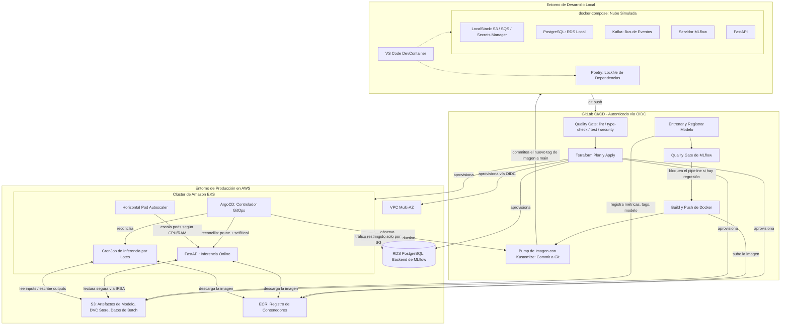

# Predicción de la Temperatura de Aceite de un Transformador: Plataforma MLOps End-to-End en AWS EKS

*Read this in other languages: [English](README.md)*

[](https://www.python.org/)
[](https://github.com/psf/black)
[](https://github.com/astral-sh/ruff)
[](https://about.gitlab.com/)
[](https://python-poetry.org/)
[](https://www.docker.com/)
[](https://kubernetes.io/)
[](https://aws.amazon.com/)
[](https://www.terraform.io/)
[](https://mlflow.org/)
[](LICENSE)

## Tabla de Contenidos

- [Resumen Ejecutivo](#resumen-ejecutivo)
- [Arquitectura del Sistema](#arquitectura-del-sistema)
- [Stack Tecnológico](#stack-tecnológico)
- [El Pipeline de MLOps](#el-pipeline-de-mlops)
- [Modelo de Seguridad](#modelo-de-seguridad)
- [Monitoreo y Observabilidad](#monitoreo-y-observabilidad)
- [Primeros Pasos](#primeros-pasos)
- [Calidad de Código y Validación Shift-Left](#calidad-de-código-y-validación-shift-left)
- [Estructura del Repositorio](#estructura-del-repositorio)
- [Decisiones Arquitectónicas y Trade-offs](#decisiones-arquitectónicas-y-trade-offs)
- [Roadmap](#roadmap)
- [Licencia](#licencia)

---

## Resumen Ejecutivo

### El Problema

Las arquitecturas de deep learning para predicción de series temporales, como DLinear, logran una precisión sólida en benchmarks como ETT (Electricity Transformer Temperature) — predecir la temperatura del aceite de un transformador a partir de su propia carga y lecturas de sensores ambientales es un problema industrial de alto valor y ampliamente estudiado. Sin embargo, existe una brecha crítica entre un modelo que funciona bien en un notebook y un modelo que corre de forma confiable en producción: dependencias no deterministas ("en mi máquina funciona"), aprovisionamiento de infraestructura manual y no documentado, versiones de modelo imposibles de trazar, y ninguna salvaguarda que impida que un modelo peor reemplace silenciosamente a uno mejor en producción.

Además, servir predicciones de series temporales típicamente requiere soportar tanto peticiones en tiempo real de baja latencia como scoring masivo por lotes (batch) offline, y hacer ambas cosas de forma ingenua implica duplicar infraestructura o aceptar un compromiso ineficiente.

### La Solución

Este repositorio implementa una plataforma MLOps de nivel producción, de extremo a extremo, que entrena, valida, registra y sirve un modelo de predicción multivariada DLinear en Amazon Web Services, construida estrictamente bajo el principio "local-first": cada capacidad se comprueba primero en una laptop con contenedores desechables, antes de apuntar jamás a una cuenta real de AWS.

La plataforma está diseñada desde el primer día bajo principios de Site Reliability Engineering: 100% de la infraestructura como código, topología de red de confianza cero (zero-trust), gestión determinista de dependencias, un sistema de inferencia híbrido (API online + scoring por lotes) que comparte una única imagen de contenedor, y un clúster de Amazon EKS gestionado con GitOps, donde el estado deseado del clúster vive en Git y no en el historial de shell de nadie.

### El Impacto

- **Ningún modelo imposible de trazar llega jamás a producción.** Cada corrida de entrenamiento queda atada a una tupla inmutable — hash del commit de Git, hash de datos de DVC, hiperparámetros, ID de la corrida de MLflow y tag de la imagen del contenedor — de modo que cualquier predicción servida en producción puede rastrearse hasta el código, los datos y la configuración exactos que la produjeron.
- **Una regresión nunca puede llegar a producción de forma automática.** El quality gate respaldado por MLflow compara cada modelo recién entrenado contra el que sirve tráfico actualmente y bloquea la promoción — y por lo tanto bloquea `build-push`/`deploy` — a menos que el nuevo modelo sea al menos igual de bueno.
- **Iteración end-to-end completa en segundos, no en horas.** Un dataset "toy" fijo de ~1.000 filas, versionado con DVC, ejercita todo el pipeline — contratos de datos, preprocesamiento, búsqueda de hiperparámetros, entrenamiento, registro en MLflow — en una laptop, sin GPU y sin costo de nube, antes de tocar jamás el dataset completo.
- **Cero configuración manual para un nuevo colaborador.** Un DevContainer más una réplica completa de la nube en `docker-compose.yml` (PostgreSQL, LocalStack, Kafka, MLflow, la API) hacen que un nuevo ingeniero corra `make up` y sea productivo de inmediato — sin instalar Python localmente, sin credenciales de AWS, sin estado compartido de "en mi máquina funciona".
- **Nada llega a AWS que no haya pasado antes por una validación local más barata y rápida, y ningún job de CI/CD consume minutos compartidos de GitLab.com.** Los git hooks de pre-commit, las pruebas de integración locales basadas en Testcontainers, un emulador local del pipeline (`gitlab-ci-local`) y dos runners self-hosted (uno en el propio hardware del desarrollador, tag `local-hardware`; otro dentro del cluster EKS, tag `in-vpc`) detectan fallos y ejecutan el pipeline real sin tocar un solo recurso de cómputo compartido de GitLab.
- **Un pronóstico real de 48 horas, no una simple consulta de un paso.** El modelo predice las próximas 48 lecturas horarias de temperatura del aceite a partir de las últimas 48 -- uno de los horizontes estándar del paper de DLinear para este mismo dataset -- en vez de predecir un solo paso adelante, que en esta serie es casi indistinguible de un baseline ingenuo ("la próxima lectura es igual a la última") y demostraría poco sobre la capacidad real de pronóstico del modelo.

---

## Arquitectura del Sistema

El sistema abarca tres ámbitos operativos: desarrollo local (una emulación completa de la nube), automatización de CI/CD, y el entorno de producción en AWS reconciliado mediante GitOps.



### Flujo de Datos

1. **Ingesta y validación.** Las lecturas crudas de los sensores ETT (7 canales numéricos, horarios) se cargan y se verifican inmediatamente contra un contrato de datos con Pydantic — esquema, tipos de dato, nulabilidad, rangos de valores por columna — antes de iniciar cualquier preprocesamiento.
2. **Ingeniería de features.** `data_processing.py` deriva features temporales (mes, día, hora), escala la serie y construye ventanas deslizantes para el modelo DLinear.
3. **Entrenamiento.** `train.py` ejecuta una búsqueda de hiperparámetros con Optuna, entrena la red DLinear, y registra métricas, parámetros y tags de reproducibilidad en MLflow — empaquetando la red entrenada junto con sus escaladores de entrada/salida en un único modelo `pyfunc` personalizado.
4. **Registro y quality gate.** El modelo entrenado se registra en el MLflow Model Registry. `quality_gate.py` solo avanza el alias `production` si el candidato es al menos tan bueno como el modelo actualmente en producción.
5. **Servicio (Serving).** Tanto la API como el CronJob de batch resuelven el modelo por `nombre@alias_production` desde el registry al arrancar — nunca desde una ruta de archivo — y sirven predicciones online o escriben predicciones por lotes de vuelta a S3, según corresponda. `POST /predict` devuelve `predictions`, una lista de 48 valores (uno por cada hora pronosticada); el scoring por lotes escribe una columna `Prediction_h1..Prediction_hN` por fila para el mismo horizonte.
6. **Despliegue.** El CI construye y sube la imagen del contenedor, y luego edita el tag de imagen del overlay de Kustomize y lo commitea a `main`. ArgoCD detecta el cambio en Git y reconcilia el clúster — el CI nunca toca directamente el servidor de la API del clúster.

---

## Stack Tecnológico

| Categoría | Herramientas Utilizadas | Propósito en el Proyecto |
|---|---|---|
| **Machine Learning** | PyTorch, DLinear, Optuna | Modelo de predicción multivariada de series temporales y búsqueda de hiperparámetros. |
| **Tracking y Registry** | MLflow (Tracking + Model Registry, aliases) | Tracking de experimentos, versionado inmutable de modelos, promoción con quality gate. |
| **Datos y Reproducibilidad** | DVC (respaldado por S3), Pydantic | Versionado de datasets/modelos y contratos de datos fail-fast. |
| **Serving de API** | FastAPI, Uvicorn | Endpoint de inferencia online de baja latencia. |
| **Contenerización** | Docker, Docker Compose | Imagen única y reproducible para inferencia online + batch; emulación completa de la nube local. |
| **Orquestación** | Kubernetes, Amazon EKS, Kustomize | Scheduling de cargas de trabajo en producción, gestión de configuración estructural (sin templates). |
| **GitOps** | ArgoCD | Reconciliación continua del estado del clúster desde Git, con auto-corrección de drift. |
| **Simulación de Nube Local** | LocalStack, Apache Kafka, Testcontainers | Emulación de S3/SQS/Secrets Manager y pruebas de integración con contenedores efímeros. |
| **Infraestructura como Código** | Terraform | Aprovisionamiento declarativo de VPC, EKS, RDS, S3, ECR, IAM. |
| **CI/CD** | GitLab CI/CD, OpenID Connect, gitlab-ci-local, runners self-hosted (Docker local + EKS) | Pipelines autenticados vía OIDC; validación local de jobs antes de hacer push; ejecución real sin consumir minutos compartidos de GitLab.com. |
| **Observabilidad y Resiliencia** | structlog, tenacity, pybreaker | Logging estructurado en JSON, reintentos acotados con backoff, circuit breaking. |
| **Servicios Cloud** | Amazon S3, ECR, RDS PostgreSQL, VPC | Almacenamiento gestionado, registry, base de datos y redes. |
| **Desarrollo Local** | DevContainers, Poetry, Makefile | Entorno estandarizado, dependencias deterministas, interfaz de ejecución única. |
| **Calidad de Código** | Ruff, Black, isort, mypy, pytest, Bandit, Trivy, yamllint, detect-secrets | Análisis estático shift-left, formateo, tipado, pruebas y escaneo de seguridad. |
| **Seguridad** | IRSA, AWS STS, redes zero-trust | Credenciales de corta duración y alcance acotado; sin secretos de larga vida en el código de la aplicación. |

---

## El Pipeline de MLOps

### Pipeline de Datos

El entrenamiento y la inferencia nunca confían ciegamente en el input crudo. `core_ml/src/data_contracts.py` declara un esquema basado en Pydantic para el dataset ETT — columnas requeridas, tipos de dato, nulabilidad y rangos de valores por feature, calibrados contra la serie completa ETTh1. `data_processing.py`, `batch_inference.py` y el modelo `PredictionRequest` de la API validan todos contra este contrato (o contra las restricciones de campo equivalentes de Pydantic, en el caso de la API) y rechazan inmediatamente — `DataContractError` en local, HTTP 422 en el borde de la API — en lugar de gastar cómputo en una corrida condenada a fallar, o peor, producir silenciosamente predicciones basura. Este es el principio **fail-fast** aplicado a los datos, no solo al código.

Para iterar rápido, `core_ml/data/toy/ETTh1_toy.csv` es un slice fijo y representativo de ~1.000 filas del dataset completo — mismo esquema, mismo contrato, menos filas — versionado con DVC. `make train-toy` corre todo el pipeline en segundos, de modo que el ciclo completo se ejercita localmente antes de tocar jamás el dataset completo o una GPU.

`core_ml/data/{raw,toy}/*.csv` están rastreados con DVC, respaldados por el mismo bucket de S3 usado para los artefactos de modelo. Solo los pequeños archivos puntero `.dvc` (hashes de contenido) se commitean a Git; `dvc pull`/`dvc push` mueven los bytes reales. Esta es la base de la tupla de reproducibilidad descrita a continuación.

### Pipeline de Entrenamiento

`train.py` ejecuta una búsqueda de hiperparámetros con Optuna sobre la arquitectura DLinear y entrena la configuración ganadora. Cada corrida queda atada, vía `mlflow_utils.py::build_reproducibility_tags()`, a cinco coordenadas registradas como tags y parámetros de MLflow:

```
Hash del Commit de Git + Hash de Datos de DVC + Hiperparámetros + ID de la Corrida de MLflow + Tag de la Imagen del Contenedor
```

Cualquier modelo en el registry puede, por lo tanto, rastrearse hasta el código, los datos, la configuración y la imagen de contenedor exactos que lo produjeron — un requisito indispensable para depurar un incidente en producción o auditar la procedencia de un modelo.

No existe ningún `model.pkl` suelto en ningún directorio de este repositorio ni de sus contenedores desplegados. `train.py` empaqueta la red DLinear entrenada junto con sus escaladores de entrada/salida en un único `mlflow.pyfunc.PythonModel` personalizado y lo registra en el MLflow Model Registry como un artefacto inmutable y versionado.

### Pipeline de Despliegue (CI/CD)

Cada push dispara un pipeline de GitLab CI/CD autenticado contra AWS vía OIDC (sin credenciales de usuario IAM de larga duración). Los stages corren estrictamente en secuencia, de modo que un fallo en cualquier etapa bloquea todo lo posterior:

```
push a main
  -> quality        (make ci: lint, formato, tipos, tests, seguridad; escaneo con Trivy)
  -> plan            (terraform plan)
  -> apply            (terraform apply, solo en la rama main)
  -> train             (búsqueda con Optuna, logging y registro en MLflow)
  -> quality-gate       (el modelo candidato debe superar a producción o el pipeline se detiene)
  -> build-push          (imagen Docker construida y subida a ECR, etiquetada con el SHA del commit)
  -> deploy               (bump de imagen con Kustomize, commiteado a main con [skip ci])
```

El stage final `deploy` nunca toca directamente el servidor de la API de Kubernetes: realiza un `kustomize edit set image` estructural sobre `kubernetes/overlays/production/`, commitea el cambio, y hace push con un marcador `[skip ci]` para evitar un loop de pipeline auto-disparado. ArgoCD, corriendo dentro del clúster, detecta el nuevo commit y reconcilia el clúster para que coincida — el CI propone, GitOps dispone.

---

## Modelo de Seguridad

La seguridad se aplica tanto en la capa de identidad como en la de red.

- **IAM Roles for Service Accounts (IRSA).** Los pods que corren la API y el job de batch acceden a S3 mediante credenciales de AWS STS de corta duración, inyectadas dinámicamente por EKS. Ninguna clave de AWS se guarda en Secrets de Kubernetes ni se hardcodea en la aplicación.
- **Integración OIDC de GitLab.** El pipeline de CI/CD se autentica contra AWS vía OpenID Connect (`aws_iam_openid_connect_provider` más un claim `sub` acotado a este proyecto/rama exactos), eliminando por completo las credenciales de usuario IAM de larga duración del CI.
- **Separación de mínimo privilegio.** El rol de GitLab CI usado para entrenamiento/build está acotado únicamente al repositorio de ECR y al bucket de S3 que realmente necesita; el rol de `apply` de Terraform se mantiene separado. Un job de build o entrenamiento comprometido no puede escalar a administrador de infraestructura.
- **Aislamiento de red.** La instancia de RDS PostgreSQL vive en subredes privadas; su Security Group solo permite tráfico desde el Security Group asociado a los nodos worker de EKS, en lugar de depender de rangos CIDR amplios.
- **GitOps como frontera de seguridad.** El CI nunca posee credenciales de administrador del clúster — solo puede proponer un cambio en Git. ArgoCD, corriendo dentro del clúster con su propio acceso acotado, es el único actor que jamás muta el estado del clúster.

---

## Monitoreo y Observabilidad

- **Logging estructurado.** `api/logging_config.py` y `core_ml/src/logging_config.py` configuran `structlog` una vez por proceso: un objeto JSON de una sola línea por evento (`event`, `level`, `timestamp`, más campos estructurados como `model_uri`, `duration_ms`, `n_predictions`) cuando la salida estándar no es una TTY, y un renderer legible y coloreado en una terminal interactiva. JSON por línea es exactamente lo que CloudWatch Logs Insights o Elasticsearch necesitan para filtrar y agregar por campo, en lugar de aplicar regex sobre texto libre.
- **Seguimiento de latencia.** Cada llamada a `/predict` registra su duración en milisegundos junto con la versión de modelo resuelta, dando una vista por request y por versión de modelo de la latencia de serving directamente en el flujo de logs.
- **Resiliencia: reintentos acotados y circuit breaker.** `api/main.py` envuelve la carga del MLflow Model Registry con `tenacity` (backoff exponencial acotado, máximo tres intentos — nunca infinito) y `pybreaker` (tras cinco fallos consecutivos, el breaker se abre y falla rápido durante 60 segundos en lugar de seguir golpeando un registry caído). `core_ml/src/batch_inference.py` aplica el mismo reintento acotado a sus llamadas a S3.
- **Detección de drift de infraestructura.** ArgoCD corre con `prune: true` y `selfHeal: true`: cualquier cambio manual con `kubectl` o drift de configuración en el clúster se detecta automáticamente y se revierte para coincidir con Git, de modo que el estado real del clúster nunca puede divergir silenciosamente de su estado declarado.
- **Degradación elegante en lugar de crash-looping.** El arranque de la API no trata "todavía no hay ningún modelo `production` registrado" como un error fatal: `/health` (liveness) siempre responde 200, mientras que `/ready` y `/predict` responden 503 hasta que se promueve un modelo — la semántica correcta de Kubernetes para separar "el proceso está vivo" de "el proceso está listo para servir".

**Limitación conocida — monitoreo de drift de datos/modelo.** Esta plataforma aún no incluye detección estadística de drift (p. ej. Evidently AI) ni un backend de métricas (Prometheus/Grafana) que rastree la distribución de las predicciones a lo largo del tiempo en producción. En la escala actual del proyecto, el quality gate de MLflow y los contratos de datos fail-fast cubren los modos de fallo más comunes y de mayor impacto — un modelo con regresión o un input malformado — antes de que puedan causar daño. El monitoreo continuo de drift es la siguiente capa a agregar a medida que se acumule tráfico real de producción; ver [Roadmap](#roadmap).

---

## Primeros Pasos

Para garantizar que el código se comporte de forma idéntica en la nube, valídalo primero contra la réplica local.

### 1. Inicializar el Entorno

Abre el repositorio en VS Code usando la extensión Dev Containers. Esto aprovisiona Python, Poetry, `make`, Terraform, la AWS CLI, Docker-in-Docker y `pre-commit` — sin necesidad de instalar Python localmente.

### 2. Instalar Dependencias y Git Hooks

```bash
make install   # poetry install --sync para api/ y core_ml/ (determinista, desde poetry.lock)
make hooks     # instala los git hooks de pre-commit (pre-commit + pre-push)
```

Ambos subproyectos (`api/` y `core_ml/`) son proyectos Poetry independientes, cada uno con su propio `poetry.lock`, de modo que el conjunto de dependencias instalado aquí es idéntico, byte a byte, al que instalan el CI y el contenedor de producción.

### 3. Levantar el Stack de Emulación Local

```bash
make up   # docker compose up -d --build --wait
```

Esto levanta toda la nube simulada, en orden de dependencias (Postgres/LocalStack saludables -> MLflow saludable -> API):

- PostgreSQL (emulación de RDS)
- LocalStack (S3 + SQS + Secrets Manager — auto-aprovisionado, ver `localstack/init/`)
- Kafka (KRaft, un solo broker)
- MLflow (tracking + registry, respaldado por los dos anteriores)
- FastAPI

`make down` lo detiene; `make logs` / `make ps` lo inspeccionan mientras corre.

### 4. Entrenar y Servir

Corre todo el pipeline de extremo a extremo primero contra el dataset toy de ~1.000 filas — la validación del contrato de datos, el preprocesamiento, el entrenamiento y el registro en MLflow se completan en segundos, sin necesidad de GPU:

```bash
make train-toy
```

Luego promuévelo para que la API pueda tomarlo:

```bash
cd core_ml && poetry run python -m src.quality_gate
```

El servicio local de FastAPI (apuntando al stack de MLflow de docker-compose) resuelve el modelo por nombre y alias `production` al arrancar — sin copiar artefactos manualmente. Una vez que tengas confianza, corre los mismos pasos contra el dataset completo (`make data-raw` + `poetry run python -m src.train --dataset raw`).

### 5. Validar Antes de Comitear

El `Makefile` es el único punto de entrada para toda verificación de calidad — exactamente los mismos targets corren localmente (vía git hooks) y en el CI:

```bash
make lint          # Ruff
make format         # isort + Black (auto-corrige)
make format-check    # isort + Black (solo verifica, usado en CI)
make type-check       # mypy
make test              # pytest + cobertura
make security           # Bandit (SAST)
make yaml-lint           # yamllint sobre todos los manifiestos de CI/K8s/compose
make secrets-scan         # detect-secrets
make trivy                 # escaneo de vulnerabilidades de dependencias/IaC (requiere Docker)
make ci                     # todo lo anterior, de una sola vez -- idéntico al stage "quality" del CI
```

`pre-commit` (instalado por `make hooks`) impone esto automáticamente: un commit se rechaza si falla el formateo, el linting, el chequeo de tipos, los tests, la sintaxis YAML, o si se detecta un secreto filtrado. Ver [Calidad de Código y Validación Shift-Left](#calidad-de-código-y-validación-shift-left) más abajo.

### 6. Validar el Pipeline de CI/CD Completo, Localmente

Todavía no se sube nada a GitLab. `gitlab-ci-local` lee el mismo `.gitlab-ci.yml` y ejecuta cualquier job dentro de contenedores Docker en esta máquina, byte a byte igual que un runner real — así los errores de sintaxis, imágenes base o `before_script` se detectan y corrigen aquí, sin gastar minutos de CI ni abrir un pipeline roto en GitLab:

```bash
make ci-local-list             # valida sintaxis/stages/needs de .gitlab-ci.yml, sin ejecutar nada
make ci-local JOB=python:quality   # corre un job puntual (uso: JOB=<nombre-del-job>)
```

> En Windows/Git Bash, `make ci-local` ya exporta `MSYS_NO_PATHCONV=1` — sin esto, Git Bash reescribe las rutas internas (`/builds/...`) que `gitlab-ci-local` pasa a `docker create`, y el job falla con `the working directory '...' is invalid` antes de ejecutar una sola línea del script.

### 7. Runner Self-Hosted: el pipeline REAL, sin gastar minutos de GitLab

`gitlab-ci-local` (paso 6) simula el pipeline *antes* del push. Para que GitLab también ejecute el pipeline *real* (el que dispara automáticamente en cada push) sin tocar los runners compartidos de GitLab.com, este mismo hardware se registra como runner self-hosted. Es la misma estrategia que ya usa `kubernetes/gitlab-runner/` para `train_model`/`quality_gate` (tag `in-vpc`, dentro del cluster EKS porque necesita el DNS interno de MLflow) — aquí se extiende con un segundo runner, en tu propio PC, para el resto de los jobs (`local-hardware`): quality, terraform, build-push y deploy.

Bootstrap (una sola vez):

```bash
# 1. GitLab.com -> proyecto (o grupo) -> Settings -> CI/CD -> Runners -> "New runner"
#    -> tags: local-hardware -> "Run untagged jobs": No -> copiar el token (glrt-...)
make runner-register TOKEN=glrt-xxxxx   # registra este PC (token queda solo en un volumen Docker, nunca en Git)
make runner-up                          # lo deja corriendo 24/7 (--restart always)
make runner-status                      # confirma que quedó conectado ("is alive")
```

A partir de aquí, cada push a GitLab despacha el pipeline completo a runners que corren en tu propia infraestructura (este PC + el pod dentro de EKS) — el contador de minutos compartidos de GitLab.com no se mueve. La autenticación contra AWS sigue siendo OIDC de corta duración (`.aws-auth`/`.aws-auth-terraform` en `.gitlab-ci.yml`); mover un job de runner nunca implica volver a credenciales estáticas.

`make runner-logs` sigue en vivo qué job está corriendo; `make runner-down` detiene el contenedor sin perder el registro (para volver a levantarlo con `make runner-up`).

### 8. Comitear y Desplegar

Una vez completada la validación local (pasos 5-6) y con el runner self-hosted activo (paso 7), sube los cambios a GitLab. El pipeline de CI/CD automáticamente corre el mismo quality gate shift-left en cada push, planifica y aplica cambios de infraestructura, entrena y evalúa un nuevo modelo con el quality gate, construye y sube la imagen del contenedor, y — solo en `main` — actualiza el tag de imagen de Kustomize para que ArgoCD pueda reconciliar el clúster.

---

## Calidad de Código y Validación Shift-Left

Este proyecto trata el desarrollo local como el primer y más barato lugar para detectar problemas ("local-first"). Toda verificación que pueda correr antes de que un commit llegue al remoto, corre ahí.

| Aspecto | Herramienta | Aplicado por |
|---|---|---|
| Determinismo de dependencias | Poetry + `poetry.lock` (uno por subproyecto) | `make install` |
| Orden de imports | isort (`profile = black`) | pre-commit + `make format` |
| Formateo de código | Black | pre-commit + `make format` |
| Linting estático | Ruff | pre-commit + `make lint` |
| Chequeo de tipos | mypy | pre-commit (hook local, venv real de Poetry) + `make type-check` |
| Pruebas unitarias | pytest + cobertura | pre-commit (hook local) + `make test` |
| SAST / linting de seguridad | Bandit | pre-commit + `make security` |
| Escaneo de vulnerabilidades de dependencias/IaC | Trivy | hook de pre-push + CI (`security:trivy`) |
| Sintaxis y estilo YAML | `check-yaml` + yamllint | pre-commit + `make yaml-lint` |
| Detección de secretos | detect-secrets | pre-commit (bloquea el commit) |
| Higiene general de archivos | pre-commit-hooks | espacios en blanco, archivos grandes, conflictos de merge, sintaxis TOML/JSON |

Un commit se **rechaza automáticamente** si falla el linting, el formateo, el chequeo de tipos o las pruebas, si un archivo YAML es inválido, o si se detecta un secreto probable. Trivy corre en `git push` (y en el CI) en lugar de en cada commit, ya que un escaneo completo de vulnerabilidades es demasiado lento para el ciclo de feedback al comitear.

El `Makefile` (`make help` lista todos los targets) es la interfaz única para todo esto — localmente y en el stage `quality` de `.gitlab-ci.yml` — de modo que nunca hay una discrepancia entre "pasó en mi máquina" y "pasó en el CI".

---

## Estructura del Repositorio

```text
612 Forecasting Oil Temperature MLOPS/
├── .devcontainer/                 # Entorno de desarrollo local estandarizado
│   ├── Dockerfile                 # Poetry, make, pre-commit, Terraform, AWS CLI
│   └── devcontainer.json
├── .gitlab-ci.yml                 # Pipeline de CI/CD (quality gate, Terraform, Docker, K8s) vía OIDC
├── .pre-commit-config.yaml        # Git hooks shift-left (lint/formato/tipos/test/secretos/YAML)
├── .yamllint.yml                  # Reglas de estilo YAML
├── .secrets.baseline              # Baseline de detect-secrets (hallazgos auditados)
├── .trivyignore                   # Hallazgos de Trivy explícitamente aceptados, con justificación
├── .dvc/                          # Configuración del remoto de DVC (versionado de datos/modelos en S3)
├── .dvcignore
├── localstack/init/                # Scripts de bootstrap: aprovisiona S3/SQS/Secrets Manager al iniciar
├── docker-compose.yml              # Postgres, LocalStack, Kafka, MLflow, API -- la nube simulada
├── Makefile                       # Interfaz de ejecución única -- local == CI
├── terraform/                     # Definiciones de IaC (AWS)
│   ├── ecr.tf                     # Registro de contenedores y políticas de retención
│   ├── eks.tf                     # Clúster de Kubernetes v1.36 con OIDC/IRSA
│   ├── iam.tf                     # Roles IAM y service accounts
│   ├── provider.tf                # Configuración de AWS y estado remoto en S3
│   ├── rds.tf                     # Backend de PostgreSQL con SG zero-trust
│   ├── s3.tf                      # Almacenamiento versionado para artefactos de ML
│   ├── variables.tf                # Variables de entorno
│   └── vpc.tf                      # Redes multi-AZ y subredes
├── kubernetes/                    # Kustomize: base + overlays (gestionado por GitOps vía ArgoCD)
│   └── base/, overlays/production/
├── gitops/argocd/                 # Manifiesto de la Application de ArgoCD + instrucciones de bootstrap
├── core_ml/                       # Entrenamiento del modelo y pipeline offline (proyecto Poetry propio)
│   ├── pyproject.toml / poetry.lock
│   ├── data/
│   │   ├── raw/ETTh1.csv.dvc      # Dataset completo, rastreado con DVC (17.420 filas)
│   │   └── toy/ETTh1_toy.csv.dvc  # Dataset toy de ~1.000 filas para corridas E2E rápidas
│   ├── src/
│   │   ├── data_contracts.py      # Contrato de datos con Pydantic + validación fail-fast
│   │   ├── data_processing.py     # Preprocesamiento de series temporales (validado por contrato)
│   │   ├── model_architecture.py  # Red DLinear -- única fuente de verdad
│   │   ├── train.py               # Loop de entrenamiento (Optuna) + logging/registro en MLflow
│   │   ├── mlflow_utils.py        # Tags de reproducibilidad + empaquetado del modelo pyfunc
│   │   ├── quality_gate.py        # Promueve una versión de modelo a `production` o bloquea el CI
│   │   ├── events.py               # Publicación de eventos a Kafka en modo best-effort
│   │   ├── logging_config.py       # structlog: logs JSON en prod, legibles en local
│   │   └── batch_inference.py      # Script de scoring masivo offline sobre S3 (envuelto en reintentos)
│   └── tests/                      # Pruebas unitarias con pytest, más tests/integration/ (Testcontainers)
├── api/                           # Lógica de inferencia online (proyecto Poetry propio)
│   ├── pyproject.toml / poetry.lock
│   ├── logging_config.py          # structlog: logs JSON en prod, legibles en local
│   ├── main.py                    # /health, /ready, /predict -- tenacity + pybreaker en la carga del modelo
│   └── tests/                     # Pruebas unitarias con pytest para main.py
├── Dockerfile                     # Imagen de producción (instala api/ solo vía poetry.lock)
├── README.md                      # Este archivo, en inglés
└── README_es.md                   # Traducción al español
```

---

## Decisiones Arquitectónicas y Trade-offs

Cada decisión no obvia listada abajo fue tomada deliberadamente, con un trade-off explícito — no por defecto ni por convención.

**FastAPI sobre Flask.** La API de inferencia necesita validar payloads de request profundamente anidados (una secuencia de 48 lecturas horarias de sensores, cada una con sus propias restricciones a nivel de campo) y se beneficia del soporte async nativo y de la documentación OpenAPI automática. El diseño de FastAPI, centrado en Pydantic, permite que la misma librería de validación usada en los contratos de datos (`core_ml/src/data_contracts.py`) sirva también como esquema de request de la API, manteniendo un único modelo mental de validación de punta a punta en lugar de dos.

**Inferencia híbrida (online + batch) sobre streaming puro.** Las predicciones en tiempo real de una sola secuencia y el scoring histórico a escala de gigabytes tienen perfiles de costo fundamentalmente distintos. En lugar de correr un servicio de streaming permanentemente aprovisionado para cargas de batch, una única imagen de contenedor sirve ambas: por defecto corre el servidor de FastAPI, pero un CronJob de Kubernetes sobreescribe su entrypoint en horarios de baja demanda para correr un script de scoring por lotes, y luego el pod se destruye. Una imagen, dos cargas de trabajo, sin infraestructura de streaming ociosa pagando por capacidad que no usa la mayor parte del tiempo.

**Aliases del MLflow Model Registry sobre `stages`.** El concepto de `stages` de MLflow (`Staging`/`Production`/`Archived`) está deprecado en favor de los aliases desde MLflow 2.9. Los aliases son un puntero mutable simple hacia una versión de modelo inmutable, lo cual mapea de forma más directa a "qué significa `production` en este momento", sin heredar la semántica de stages que el proyecto no necesita (por ejemplo, un entorno de staging formal).

**Poetry sobre pip + `requirements.txt`.** Un lockfile solo es una garantía si la resolución es determinista y el archivo realmente se commitea y se instala con `--sync`. Poetry ofrece ambas cosas por construcción; un `pip freeze > requirements.txt` suelto no evita el drift de dependencias transitivas entre la máquina de un desarrollador, el CI y la imagen de producción.

**DVC + S3 sobre un feature store completo.** Al volumen de datos y tamaño de equipo de este proyecto, un feature store (Feast, Tecton) agregaría superficie operativa — una capa de serving, un pipeline de materialización — sin un beneficio correspondiente: hay un solo dataset, un solo target, y ninguna necesidad de servir features a múltiples consumidores independientes. DVC da versionado de datasets y reproducibilidad a una fracción del costo operativo, y puede reemplazarse más adelante si la superficie de features crece.

**LocalStack sobre una cuenta de sandbox de AWS compartida.** Emular S3/SQS/Secrets Manager localmente significa que cada colaborador (y cada job de CI) obtiene un entorno de AWS aislado, gratuito y desechable, en lugar de competir por una cuenta de sandbox compartida, preocuparse por estado remanente, o pagar por recursos cloud ociosos durante el desarrollo.

**GitOps (ArgoCD, basado en pull) sobre que el CI empuje directamente al clúster.** Si el CI tuviera credenciales de `kubectl` hacia el clúster de producción, un pipeline comprometido (o un script con errores) podría mutar el clúster de forma directa e invisible. Con ArgoCD, el radio de impacto del CI se limita a comitear un archivo a Git; solo ArgoCD, corriendo dentro del clúster con su propio acceso acotado, tiene permitido mutar el estado del clúster — y cualquier drift manual se revierte automáticamente (`selfHeal: true`).

**Kustomize sobre Helm.** Este proyecto tiene una sola aplicación con una única diferencia legítima por entorno (el tag de imagen y un par de valores específicos de la cuenta). El modelo de Kustomize, basado en parches y sin templates, encaja mejor que introducir un motor de templating completo y una historia de versionado de charts para un solo overlay; Helm se vuelve el mejor trade-off una vez que hay múltiples entornos o la necesidad de distribuir el chart externamente.

**Wheel de PyTorch solo-CPU en vez del build con CUDA por defecto.** Ningún nodo de este cluster tiene GPU (el node group de inferencia es `t3.large`), y `train.py` ya resuelve el dispositivo de cómputo en tiempo de ejecución (`torch.device("cuda" if torch.cuda.is_available() else "cpu")`), así que una GPU se usaría automáticamente si alguna vez hubiera una disponible -- pero el wheel *por defecto* de `torch` en PyPI trae empaquetado el runtime completo de CUDA (varios GB de paquetes `nvidia-*`), peso muerto que nunca se ejecuta en esta infraestructura. Fijar `torch` al índice de wheels solo-CPU del propio PyTorch (`api/pyproject.toml`, `core_ml/pyproject.toml`) redujo la imagen de la API de ~8.3GB a ~1.2GB, lo que de paso corrigió timeouts de red reales y reproducibles en `docker push` bajo contención del host -- un trade-off de corrección/costo que además resolvió un problema de confiabilidad.

**Publicación de eventos en Kafka en modo best-effort, no como dependencia dura.** `batch_inference.py` publica un evento de finalización después de cada corrida de batch, pero una caída del broker nunca hace fallar el pipeline — se registra una advertencia y se continúa. La observabilidad nunca debe convertirse en un punto único de fallo para el propio proceso que observa.

**Sin un stack de monitoreo de drift todavía (Evidently/Prometheus/Grafana).** Esta es una decisión consciente de alcance, no un descuido: a la escala de tráfico actual, el quality gate de MLflow y los contratos de datos fail-fast ya previenen los dos modos de fallo con mayor probabilidad y costo — un modelo con regresión llegando a producción, e input malformado llegando al modelo. Una capa completa de monitoreo estadístico de drift es trabajo real y valioso para una fase futura (ver [Roadmap](#roadmap)), pero se despriorizó en favor de reforzar primero las garantías de despliegue y reproducibilidad.

---

## Roadmap

- Monitoreo estadístico de drift de datos/concepto (Evidently AI) con un dashboard de Prometheus + Grafana para las distribuciones de predicciones y la latencia de serving a lo largo del tiempo.
- Entrega progresiva (rollouts canary o blue/green) vía Argo Rollouts, en reemplazo del rollout directo actual al actualizar la imagen.
- Soporte multi-modelo en el registry (por ejemplo, modelos por región o por segmento) detrás del mismo patrón de resolución `nombre@alias`.
- Benchmarking de costo y rendimiento del CronJob de batch al volumen completo de datos de producción, con paralelismo autoescalado.

---

## Licencia

Este proyecto está licenciado bajo la Licencia MIT — ver [LICENSE](LICENSE) para más detalles.
